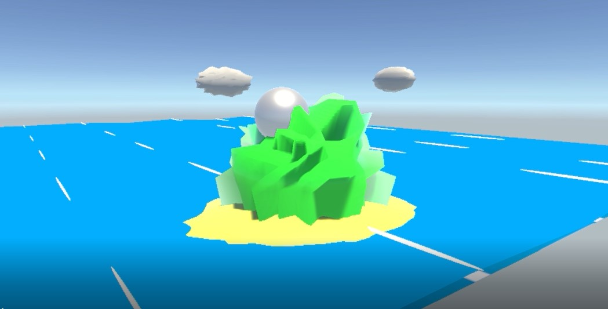
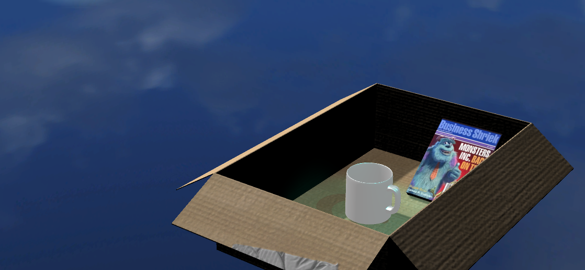
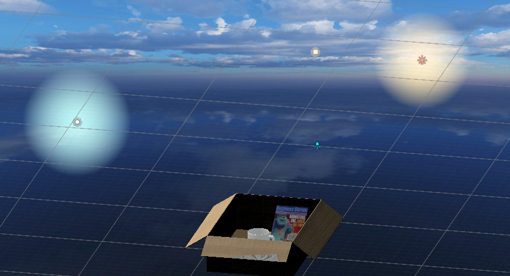
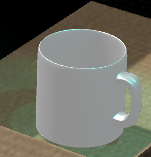
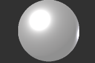
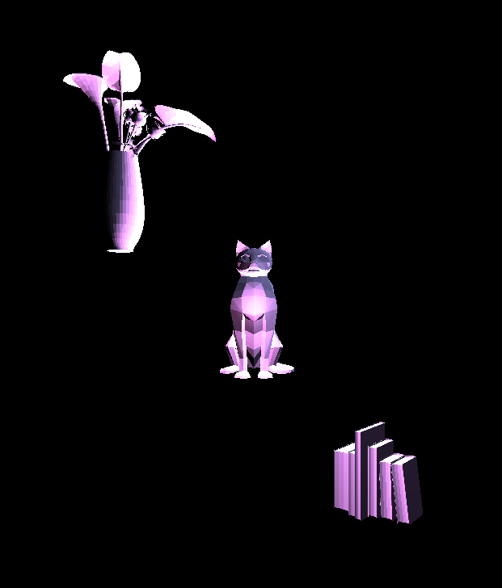

# CMPM163Labs
## Lab 7
https://drive.google.com/file/d/1_-s0Jj13oWqgNXLRpu4038Op7awtNnwl/view?usp=sharing

Mountain: I used vertex shaders to manipulate a pill shaped mesh to make random spikes on the mesh. 

I used the same method for the clouds and the beach that are in the scene with appropriate fiddling of the slider.

Waves: I applied a shader code that uses a math equation to animate the plane into a wave motion. I added a second material that appears under the waves to add some dimension to it.  I applied the same shader to the foam that rides along the waves except that I changed the color to white. 

## Lab 6

#### Lights
Area Light: only works on a baked light map and shines in all directions to one side of a rectangular plane

Spot Light: lights up all objects within a cone: responds to both rotation and position

Directional Light: effects all objects on the scene set by the game object's rotation; postion does not matter

Point Light: lights up objects depending on its position on the screen and shines equally in all directions

#### Material
I made the material by setting the shader to standard(specular setup), changed the rendering mode to opaque, and decreased the smoothness to make it resemble a pearl.

 

#### Textures
Cardboard box: imported from a website, added texture, normal maps, and metallic maps and adjusted smoothness to my liking.

Business Shriek Magazine: created my own mesh and took a magazine png online and converted it into a texture. And increased the metallic so the cover can be easily seen

#### Skybox
I added a clear sunny day with very aesthetic clouds skybox. 

## Lab 5 
https://drive.google.com/file/d/1CzOp2suzvq7O6BoS9HNcQlruJvUwHuB5/view?usp=sharing

I changed the entire theme of the dessert racetrack to a desert themed racetrack. I imported models and placed them around the track as part of the scenery outside the road. All models are not mine. 

## Lab 4 
https://drive.google.com/file/d/19rrsiamw0hqsjwCx2-XK2L9Z60hUyuEo/view?usp=sharing

- What is the formula given a u value of the uv coordinate (a value between 0 and 1), I get the x value of the pixel to sample from in this 8x8 texture?

u = x * 0.14

- What is the formula given a v value of the uv coordinate (a value between 0 and 1), I get the y value of the pixel to sample from in this 8x8 texture?

y = v * 0.14

- What color is sampled from the texture at the uv coordinate (0.375, 0.25)? (sample from the image based on the number your formula gives you i.e. (1, 0) is blue)

black

top left - I scaled the image down and placed each image in every corner in the fragment shader

top right - I used the fragment shader to output the texture 

bottom left -  Along with the texture, I loaded it with a normal map onto another cube

bottom middle - I loaded the texture onto the cube with the phong material 

bottom right - Along with the texture, I loaded it with a normal map

## Lab 3: 
https://drive.google.com/file/d/1PgLWZ6pAk4TViyQewtNJaF6jvGRHFr5R/view?usp=sharing

top left - i mixed two colors to form a slow gradual gradient along the Y axis

top right - i interpolated between two colors 

bottom left - i set the wireframe to true 

bottom right - i set the specular to green 

## lab 2:

part1 - https://drive.google.com/file/d/1a05O312UkPm1J6kMKuIAJCvsdFb_U0_P/view?usp=sharing

part 2 - 
